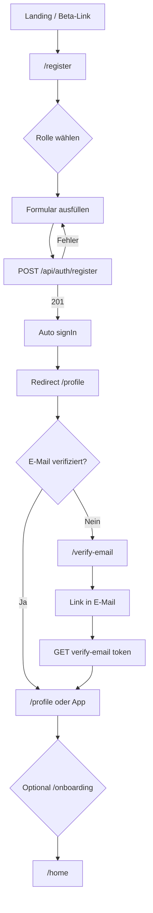

# Registrierung & Onboarding — Überblick & Beta-Tester-Flow

Stand: aus dem Code (`app/register`, `app/onboarding`, `app/api/auth/register`, `middleware.ts`) abgeleitet.

---

## 1. Technischer Ablauf (Ist-Zustand in der App)

### Registrierung (`/register`)

| Schritt | Was passiert |
|--------|----------------|
| 1 | Nutzer wählt **Rolle**: Shugyo oder Takumi (`RoleSelector`). |
| 2 | Formular: **Name**, **Benutzername** (Live-Check `GET /api/user/check-username`), **E-Mail**, **Passwort** + Bestätigung, Passwortstärke-Anzeige. |
| 3 | Verstecktes **Honeypot**-Feld `_hp` (Bots → scheinbarer Erfolg, kein Account). |
| 4 | `POST /api/auth/register`: Passwort-Regeln (≥8 Zeichen, mind. eine Zahl oder Sonderzeichen), Rate-Limits (IP / E-Mail), Duplikat-Check. |
| 5 | User in DB: `role: user`, **`appRole: shugyo`** (serverseitig immer zunächst Shugyo — Takumi-Rolle kommt später über Profil/Expert). |
| 6 | **Verifizierungs-E-Mail** (Token 24h), **Welcome-Waymail** (`sendWelcomeWaymail`). |
| 7 | Client: **`signIn` (Credentials)**, `setRole(selectedRole)` nur im **Client-State** (`AppContext`), dann **`window.location.href = "/profile"`**. |

### E-Mail-Verifizierung (Middleware)

| Schritt | Was passiert |
|--------|----------------|
| 1 | Eingeloggt **ohne** `emailConfirmedAt` → Zugriff auf geschützte Routen **nicht** erlaubt. |
| 2 | Redirect zu **`/verify-email`** (Ausnahmen: u. a. `/login`, `/register`, `/api/auth/*`, `/takumi/*`, `/beta`, …). |
| 3 | Link in E-Mail → **`/api/auth/verify-email/[token]`** → danach Session mit bestätigter E-Mail. |
| 4 | Seite **`/verify-email`** leitet bei bestätigter E-Mail nach **`/home`** weiter; **Erneut senden** über `POST /api/auth/resend-verification`. |

### Profil vs. Onboarding

- Nach Registrierung ist die erste Ziel-URL **`/profile`** — wird ohne Verifizierung vom Middleware auf **`/verify-email`** umgebogen.
- **`/onboarding`** ist ein **mehrstufiger Wizard** (Fortschritt, Skip nach `/home`):
  - **Shugyo:** 3 Schritte — Avatar-Platzhalter, Interessen (Kategorien), Abschluss-Screen.
  - **Takumi:** 4 Schritte — Avatar-Platzhalter, Expertise (Kategorien), Bio + Preis-Felder (UI), Abschluss-Screen.
- Der Wizard speichert die Eingaben **in diesem Stand nicht vollständig per API** (v. a. Avatar-Button ohne Upload-Logik im gezeigten Code); „Fertig“ navigiert zu **`/home`**. Für echtes Profil: **`/profile`** / **`/profile/edit`** (Takumi).

---

## 2. Mermaid: Ablaufdiagramm (vereinfacht)

---

## 3. Beta-Tester-Flow (empfohlene Schritte)

Ziel: Tester führen den **realen** Pfad einmal durch und notieren Abweichungen.

| # | Aktion | Erwartung |
|---|--------|-----------|
| 1 | Beta-URL öffnen (z. B. `/beta/de` oder Produktions-URL). | Marketing-Seite lädt. |
| 2 | **Registrieren** (`/register`). | Rolle + Formular; keine Fehler bei gültigen Daten. |
| 3 | Posteingang prüfen. | **Verifizierungs-Mail** innerhalb weniger Minuten. |
| 4 | Falls App nach Login „hängt“: manuell **`/verify-email`** aufrufen. | Hinweis + Resend möglich. |
| 5 | Link in E-Mail klicken. | Erfolg, Zugriff auf App (`/home` oder Redirect). |
| 6 | **`/profile`** / **`/profile/edit`** (Takumi: Expertenprofil, Preise). | Daten persistieren. |
| 7 | Optional **`/onboarding`** ausprobieren. | UI durchklickbar; Skip möglich. |
| 8 | Kurz testen: **Suche**, **eine Buchungsanfrage** (wenn im Scope). | Kernflows ok. |

**Hinweise für Tester**

- Passwort: mindestens **8 Zeichen** und mindestens **eine Zahl oder ein Sonderzeichen**.
- Benutzername: muss **frei** sein (Echtzeit-Prüfung).
- Ohne E-Mail-Bestätigung: **kein** Zugriff auf geschützte Bereiche (außer den in der Middleware explizit erlaubten Pfaden).

---

## 4. Mockup-Formular

Statisches **Wireframe-Mockup** (nicht an die API angebunden):

- Datei: [`docs/mockups/beta-tester-signup-mockup.html`](./mockups/beta-tester-signup-mockup.html)  
- Im Browser öffnen oder als PDF drucken für Workshops.

---

## 5. Relevante Dateien (Referenz)

| Bereich | Pfad |
|--------|------|
| Registrierungs-UI | `app/register/page.tsx` |
| Registrierungs-API | `app/api/auth/register/route.ts` |
| Onboarding-UI | `app/onboarding/page.tsx` |
| E-Mail prüfen | `app/verify-email/page.tsx`, `middleware.ts` |
| Verifizierungs-Link | `app/api/auth/verify-email/[token]/route.ts` |
